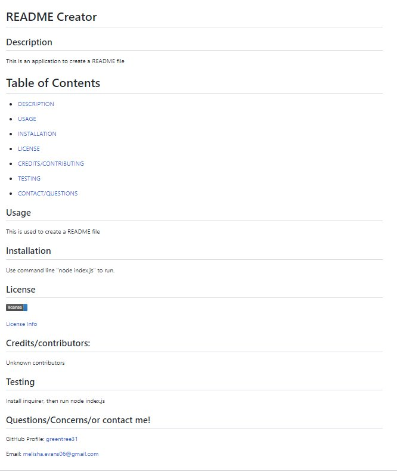

# README Generator

## Description

This is a ReadME generator that can be used for any new project.

## Table of Contents

*[Usage](#Usage)

*[Installation](#Installation)

*[License](#License)

*[Credits](#Credits)

*[Testing](#Testing)

## Installation

First go to **README** Inquirer Generator Repository Then Pull Down the Repo into your machine, using git clone with the integrated terminal.

Next run npm install within the intergrated termina, in order to install inquirer npm package dependencies.

Then run the application with the command ***node index.js***.

Answer the prompts that will appear in the terminal and your **README** file will be created once done.

## Prompts

_pro

## Final Product

## Video of the Generator

[https://drive.google.com/file/d/1QtO3N7Emqxc2TU7oncQm-ctBOxOEymK1/view](https://drive.google.com/file/d/1QtO3N7Emqxc2TU7oncQm-ctBOxOEymK1/view)

## Credits

Melisha Evans

## Technology

This was created with Javascript and Node.js

## License

MIT License

## Acceptance Criteria

* GIVEN a command-line application that accepts user input
* WHEN I am prompted for information about my application repository
* THEN a high-quality, professional README.md is generated with the title of my project and sections entitled Description, Table of Contents, Installation, Usage, License, Contributing, Tests, and Questions
* WHEN I enter my project title
* THEN this is displayed as the title of the README
* WHEN I enter a description, installation instructions, usage information, contribution guidelines, and test instructions
* THEN this information is added to the sections of the README entitled Description, Installation, Usage, Contributing, and Tests
* WHEN I choose a license for my application from a list of options
* THEN a badge for that license is added near the top of the README and a notice is added to the section of the README entitled License that explains which license the application is covered under
* WHEN I enter my GitHub username
  THEN this is added to the section of the README entitled Questions, with a link to my GitHub profile
* WHEN I enter my email address
* THEN this is added to the section of the README entitled Questions, with instructions on how to reach me with additional questions
* WHEN I click on the links in the Table of Contents
* THEN I am taken to the corresponding section of the README
